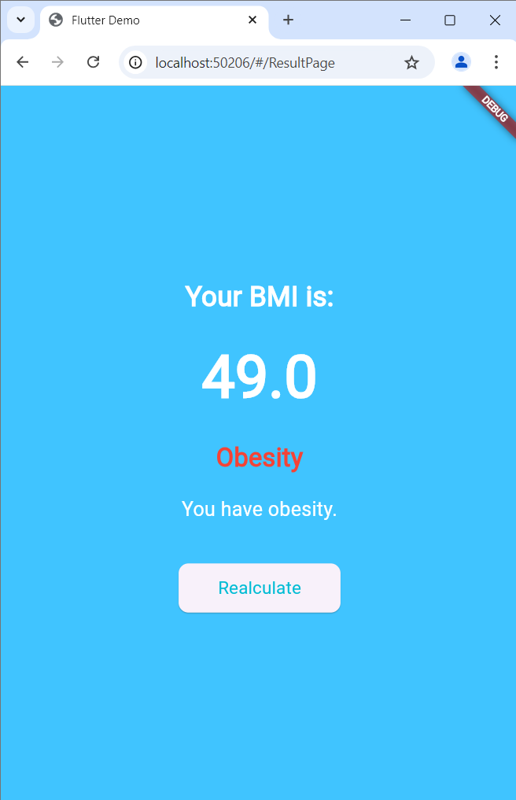

# bmi_calculator

This is a simple Flutter-based BMI calculator app. It allows users to input their weight, height, and age to calculate their BMI and receive feedback.

## Features
- Gender selection
- Weight, height, and age input
- Real-time BMI calculation
- Visual representation of results

## Screenshots

Here are some screenshots of the app:

## How to run

1. Clone the repository.
2. Run `flutter pub get` to install dependencies.
3. Use `flutter run` to launch the app.

